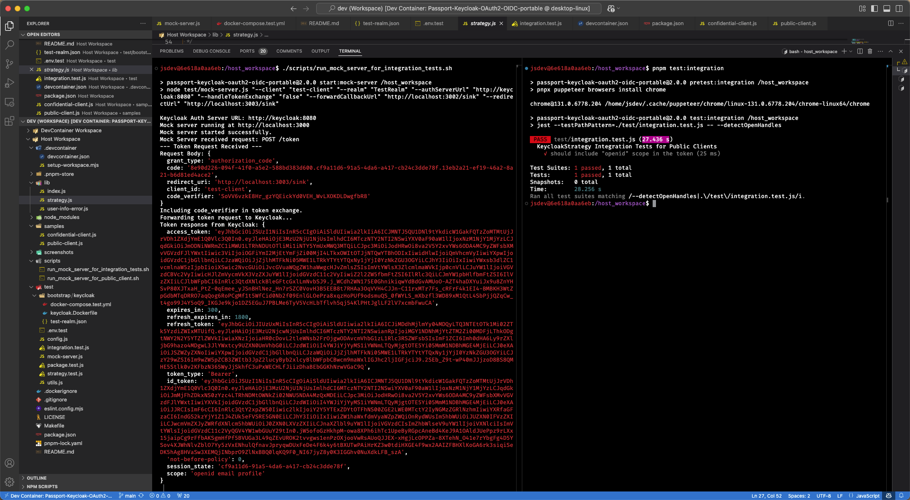

# passport-keycloak-oauth2-oidc-portable

[Passport](http://passportjs.org/) strategy for authenticating with [Keycloak](http://www.keycloak.com/) using the OAuth2/OIDC API.

This module lets you authenticate using Keycloak in your Node.js applications. By plugging into Passport, Keycloak authentication can be easily and unobtrusively integrated into any application or framework that supports [Connect](http://www.senchalabs.org/connect/)-style middleware, including [Express](http://expressjs.com/).

---

## Why I Did This

[This project](https://github.com/louie007/passport-keycloak-oauth2-oidc) wasn’t up to date for some time. I forked it to bring it into the modern world while trying out a few things I’ve been exploring with Keycloak. You can check out my blog for insights and tutorials: [blog.brakmic.com](https://blog.brakmic.com).

---

## What's New in This Fork?

Here’s a rundown of what I’ve added and updated:

- **Devcontainer Support**: Full support for Visual Studio Code Dev Containers to streamline development.
- **Keycloak via Docker Compose**: Keycloak is now effortlessly launched in its own container, accessible:
  - From the devcontainer: `http://keycloak:8080` (internal) and `http://keycloak:9000` (health/ready checks).
  - From your browser: `http://localhost:8080` and `http://localhost:9000`.
- **Integration Tests**: Added tests to validate OpenID Connect flows and scope handling.
- **Mock Server for Testing**: A dedicated mock server (`test/mock-server.js`) for simulating complete OpenID Connect flows.
- **Shared Network**: A shared Docker network enables communication between the devcontainer and the Keycloak container.
- **Linting**: Configured ESLint for consistent code style (`eslint.config.js`).
- **Utility Scripts**: Added utility functions for managing the Keycloak container and workspace configurations.
- **Modern Testing Framework**: Migrated from Mocha to Jest for speed and developer comfort.
- **Efficient Package Management**: Switched to PNPM for better dependency management. Nothing against npm—it’s just that PNPM is way better, faster, and more elegant.
- **CI-Ready Scripts**: Scripts for starting/stopping Keycloak, running tests, and linting are all in `package.json`.
- **Scripts for Starting Mock Server in Different Scenarios**: Added two scripts located in the `scripts` folder:
  - `run_mock_server_for_integration_tests.sh`: Starts the mock server configured for integration tests.
  - `run_mock_server_for_public_client.sh`: Starts the mock server configured for public client usage.

---

## Install

```bash
$ pnpm install passport-keycloak-oauth2-oidc-portable
```

---

## Usage

### Create an Application

Before using `passport-keycloak-oauth2-oidc-portable`, you must create a `realm` and `client` in Keycloak. Ensure that:

1. Your client is properly configured (e.g., `Access Type`, `Redirect URIs`).
2. Your realm includes the necessary scopes and role mappings.

---

### Configure Strategy

The Keycloak authentication strategy authenticates requests by delegating to your Keycloak server using the OpenID Connect (OIDC/OAuth 2.0) protocol.

**Options:**
- `realm`: Name of your Keycloak realm (default: `master`).
- `authServerURL`: Base URL for your realm's authorization endpoint.
- `publicClient`: Whether the Keycloak client’s `Access Type` is `public` (default: `true`).
- `clientID`: Application Name, Resource, or OAuth Client Name.
- `clientSecret`: Required if `publicClient` is `false`.
- `callbackURL`: Redirect URL for post-authentication.
- `sslRequired`: SSL requirement (`all`, `external`, or `none`; default: `external`).

---

### Example 1: Confidential Client

```javascript
var KeyCloakStrategy = require('passport-keycloak-oauth2-oidc-portable').Strategy;
passport.use(
  new KeyCloakStrategy(
    {
      clientID: 'myOauthClient',
      realm: 'MyKeyCloakRealm',
      publicClient: false,
      clientSecret: '6ee0f303-faef-42d7-ba8e-00cdec755c42',
      sslRequired: 'external',
      authServerURL: 'https://your.keycloak.com/',
      callbackURL: 'https://your.server.com/callback',
    },
    function (accessToken, refreshToken, profile, done) {
      User.findOrCreate(..., function (err, user) {
        done(err, user);
      });
    }
  )
);
```

---

### Example 2: Public Client (`publicClient=true`) with Local Keycloak and Mock Server

This example demonstrates how to configure a public client and use a mock server to simulate the complete OpenID Connect flow.

1. **Start Keycloak via Docker Compose:**

   ```bash
   sudo docker compose -f test/bootstrap/docker-compose.test.yml up -d
   ```

2. **Start the Mock Server:**

   ```bash
   pnpm run mock-server
   ```

3. **Example Code:**

   ```javascript
   const express = require('express');
   const passport = require('passport');
   const KeyCloakStrategy = require('passport-keycloak-oauth2-oidc-portable').Strategy;

   const app = express();

   // Configure the Keycloak Strategy
   passport.use(
     new KeyCloakStrategy(
       {
         clientID: 'test-client', // Replace with your clientID
         realm: 'TestRealm',      // Replace with your realm
         publicClient: true,
         sslRequired: 'none',
         authServerURL: 'http://keycloak:8080', // Ensure Keycloak is running
         callbackURL: 'http://localhost:3000/callback',
       },
       (accessToken, refreshToken, profile, done) => {
         // Verify callback
         console.log('User profile:', profile);
         return done(null, profile);
       }
     )
   );

   // Middleware for passport
   app.use(passport.initialize());

   // Route to initiate authentication
   app.get(
     '/auth/keycloak',
     passport.authenticate('keycloak', { scope: ['openid', 'profile', 'email'] })
   );

   // Callback route
   app.get(
     '/auth/keycloak/callback',
     passport.authenticate('keycloak', { failureRedirect: '/login' }),
     (req, res) => {
       res.send('Authentication Successful!');
     }
   );

   // Start the server
   app.listen(3000, () => {
     console.log('Server running on http://localhost:3000');
   });
   ```

---

### Authenticate Requests

Use `passport.authenticate()` to authenticate incoming requests. Refer to the examples for detailed implementations.

---

### How to Get Roles

To include roles in the UserInfo response:

1. Navigate to **Clients Scopes -> Roles -> Settings** in Keycloak.
2. Enable **Include In Token Scope**.
3. Configure Role Mappers for the client:
   - **Mapper Type:** `User Client Role`
   - **Multivalued:** `true`
   - **Token Claim Name:** `roles.resource_access.${client_id}.roles`
   - **Add to UserInfo:** `enabled`.

---

## Development

### Scripts for Starting Mock Server in Different Scenarios

To facilitate different testing and usage scenarios, two scripts have been added to the `scripts` subfolder:

1. **`run_mock_server_for_integration_tests.sh`:** Configures and starts the mock server for integration testing.
2. **`run_mock_server_for_public_client.sh`:** Configures and starts the mock server for public client usage.

**Make Scripts Executable:**

Ensure that the scripts have execute permissions. You can set this by running:

```bash
chmod +x scripts/run_mock_server_for_integration_tests.sh
chmod +x scripts/run_mock_server_for_public_client.sh
```

#### 1. Running Integration Tests

Integration tests validate the complete OpenID Connect flow, ensuring that authentication and authorization mechanisms work as expected.

**Steps:**

1. **Start the Mock Server for Integration Tests:**

   ```bash
   ./scripts/run_mock_server_for_integration_tests.sh
   ```

   **Script Contents (`run_mock_server_for_integration_tests.sh`):**

   ```bash
   #!/usr/bin/env bash

   pnpm start:mock-server --client test-client --realm TestRealm --authServerUrl http://keycloak:8080 \
   --handleTokenExchange false --forwardCallbackUrl http://localhost:3002/sink \
   --redirectUrl http://localhost:3003/sink
   ```

   **Explanation:**
   - **`--handleTokenExchange false`:** The mock server forwards the token exchange process instead of handling it internally.
   - **`--forwardCallbackUrl http://localhost:3002/sink`:** Specifies where to forward the authorization code.
   - **`--redirectUrl http://localhost:3003/sink`:** Sets the redirect URL after handling the token exchange.

2. **Run Integration Tests:**

   ```bash
   pnpm test:integration
   ```

   This command executes the integration tests, which utilize the mock server to simulate authentication flows.

    

#### 2. Running Public Client

The public client example demonstrates how to authenticate using the public client configuration with Keycloak.

**Steps:**

1. **Start the Mock Server for Public Client:**

   ```bash
   ./scripts/run_mock_server_for_public_client.sh
   ```

   **Script Contents (`run_mock_server_for_public_client.sh`):**

   ```bash
   #!/usr/bin/env bash

   pnpm start:mock-server --client test-client --realm TestRealm --authServerUrl http://keycloak:8080 \
   --handleTokenExchange true --redirectUrl http://localhost:3000/callback
   ```

   **Explanation:**
   - **`--handleTokenExchange true`:** The mock server handles the token exchange process internally.
   - **`--redirectUrl http://localhost:3000/callback`:** Sets the redirect URL after successful authentication.

2. **Run the Public Client:**

   ```bash
   node samples/public-client.js --clientId test-client --authServerUrl http://keycloak:8080
   ```

   **Explanation:**
   - **`--clientId test-client`:** Specifies the Keycloak client ID to use.
   - **`--authServerUrl http://keycloak:8080`:** Points to the Keycloak server's URL within the devcontainer.

   

## Additional Information

### Accessing Keycloak from Devcontainer

Due to network configurations within the devcontainer, `http://localhost:8080` is inaccessible. Instead, you should use `http://keycloak:8080` to interact with the Keycloak server from within the devcontainer. This setup allows seamless communication between services running inside the devcontainer and the Keycloak server running in a separate Docker container.

**Key Points:**

- **Hostname Configuration:**
  - The Keycloak server's hostname is set to `keycloak`, ensuring that services within the devcontainer can resolve it correctly.
  - `KC_HOSTNAME_STRICT` is set to `false` to allow external access via `http://localhost:8080` from your host machine's browser.

## License

[MIT](./LICENSE)
